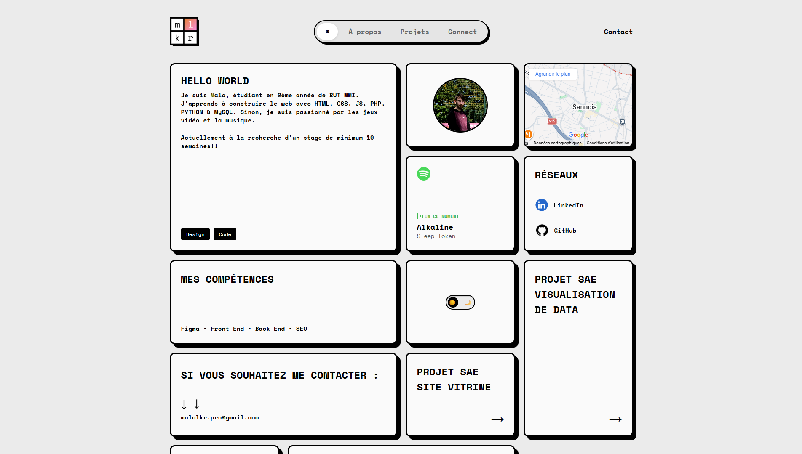

<a id="readme-top"></a>

<div align="center">
  <a href="https://github.com/mlkr-pro">
    
  </a>

  <h3 align="center">Malo LE CAER - Portfolio</h3>

  <p align="center">
    Un portfolio moderne et responsive utilisant une mise en page Bento Grid et des animations GSAP fluides.
    <br />
    <a href="https://malolecaer.fr"><strong>Voir la Démo »</strong></a>
    <br />
    <br />
    <a href="https://github.com/mlkr-pro/Portfolio/issues">Signaler un bug</a>
    ·
    <a href="https://github.com/mlkr-pro/Portfolio/issues">Demander une fonctionnalité</a>
  </p>
</div>

<details>
  <summary>Table des matières</summary>
  <ol>
    <li>
      <a href="#a-propos-du-projet">À propos du projet</a>
      <ul>
        <li><a href="#construit-avec">Construit avec</a></li>
      </ul>
    </li>
    <li>
      <a href="#installation">Installation</a>
    </li>
    <li><a href="#fonctionnalites">Fonctionnalités</a></li>
    <li><a href="#contact">Contact</a></li>
  </ol>
</details>

## À propos du projet



Ce projet est mon portfolio personnel développé durant ma 2ème année de **BUT MMI** (Métiers du Multimédia et de l'Internet).

L'objectif était de créer une identité numérique unique qui met en valeur mes compétences en **Développement Web** et en **Design**. J'ai choisi une mise en page de type **Bento Grid** pour organiser le contenu de manière efficace tout en conservant une esthétique moderne.

Points clés du projet :
* **Interface Interactive :** Animations de filtrage fluides utilisant la bibliothèque GSAP Flip.
* **Expérience Utilisateur :** Mode Sombre/Clair intégré et design entièrement responsive.
* **Vitrine de Projets :** Présentation détaillée de mes projets académiques et personnels.

<p align="right">(<a href="#readme-top">retour en haut</a>)</p>

### Construit avec

Ce portfolio est un site statique construit avec des technologies web modernes :

* [![HTML][HTML5]][HTML-url]
* [![CSS][CSS3]][CSS-url]
* [![JavaScript][JavaScript]][JS-url]
* 

<p align="right">(<a href="#readme-top">retour en haut</a>)</p>

## Installation

Pour lancer une copie locale du projet, suivez ces étapes simples.

1.  Clonez le dépôt
    ```sh
    git clone [https://github.com/mlkr-pro/Portfolio.git](https://github.com/mlkr-pro/Portfolio.git)
    ```
2.  Ouvrez le dossier dans votre éditeur de code (VS Code, etc.).
3.  Lancez le fichier `index.html` dans votre navigateur (ou utilisez l'extension **Live Server** pour une meilleure expérience).

<p align="right">(<a href="#readme-top">retour en haut</a>)</p>

## Fonctionnalités

- [x] **Mise en page Bento Grid :** Un système de grille responsive qui s'adapte à toutes les tailles d'écran.
- [x] **Animations GSAP :** - Animations "FLIP" fluides lors du filtrage des projets.
    - Effet "Machine à écrire" pour la biographie.
    - Effets de survol interactifs sur les cartes.
- [x] **Mode Sombre :** Un interrupteur pour changer le thème avec sauvegarde des préférences (localStorage).
- [x] **Modales Projets :** Intégration d'une lightbox pour visualiser les images des projets en grand.
- [x] **Intégration Google Maps :** Carte stylisée personnalisée (compatible avec le mode sombre).

<p align="right">(<a href="#readme-top">retour en haut</a>)</p>

## Contact

**Malo LE CAER** - Étudiant & Développeur Web

* **Email :** [malolkr.pro@gmail.com](mailto:malolkr.pro@gmail.com)
* **LinkedIn :** [linkedin.com/in/malo-le-caer](https://www.linkedin.com/in/malo-le-caer)
* **GitHub :** [github.com/mlkr-pro](https://github.com/mlkr-pro)

<p align="right">(<a href="#readme-top">retour en haut</a>)</p>

[HTML5]: https://img.shields.io/badge/html5-%23E34F26.svg?style=for-the-badge&logo=html5&logoColor=white
[HTML-url]: https://developer.mozilla.org/en-US/docs/Web/HTML
[CSS3]: https://img.shields.io/badge/css3-%231572B6.svg?style=for-the-badge&logo=css3&logoColor=white
[CSS-url]: https://developer.mozilla.org/en-US/docs/Web/CSS
[JavaScript]: https://img.shields.io/badge/javascript-%23323330.svg?style=for-the-badge&logo=javascript&logoColor=%23F7DF1E
[JS-url]: https://developer.mozilla.org/en-US/docs/Web/JavaScript